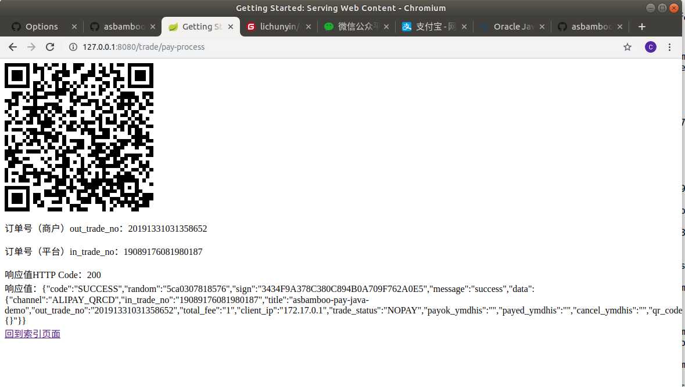

# java-sdk-demo

java-sdk-demo 是 asbamboo/java-sdk 使用示例， demo的目的是演示如何和使用 asbamboo/java-sdk 调用 http://api.asbamboo.com 中的各个接，所以demo中逻辑处理很松散。

实际应用程序开发时，需要根据实际应用程序的需要做程序自身的逻辑处理。

# 开发说明

java-sdk-demo 是java se 1.8开发。

java-sdk-demo 的版本编号会保持与java-sdk的版本号一致，除了最后一位，bug处理的编号。
 - 如 java-sdk1.0.0 的 demo 可以是 java-sdk-demo1.0.0或者 java-sdk-demo1.0.1 等等
 - 如 java-sdk1.1.0 的 demo 可以是 java-sdk-demo1.1.0或者 java-sdk-demo1.1.1 等等

java-sdk-demo 程序基于 https://github.com/spring-guides/gs-serving-web-content 开发, 请参考springboot相关文档

# 参数配置

为运行 java-sdk-demo，你首先需要做好参数的配置,修改配置文件 `java-sdk-demo/src/main/java/asbamboo/Configure.java` 中的几个属性

```
user@~:~/java-sdk-demo/src/main/java/asbamboo$ cat Configure.java 
package asbamboo;

import java.io.File;

/**
 * 
 * @author 李春寅<licy2013@aliyun.com>
 * @date 2019年1月24日
 */
public class Configure 
{
	public static String API_URL = "http://developer.asbamboo.com/api"; //目前聚合平台有开发和正式两种环境。
	
	public static String API_APP_KEY = "你的应用的App key";
	
	public static String API_SECRET = "你的应用的 app SECRET"
 
 ...
}

```
如果你还没有app key与app secrect 请前往 http://www.asbamboo.com 配置。


# java-sdk-demo 运行

在linux下，需要在 java-sdk-demo 工作目录下运行如下命令启动web服务, 然后在浏览器中运行 http://127.0.0.1:8080:

```
user@～:/java/java-sdk-demo$ ./gradlew build
Starting a Gradle Daemon, 1 busy Daemon could not be reused, use --status for details

BUILD SUCCESSFUL in 19s
3 actionable tasks: 2 executed, 1 up-to-date
user@~:/java/java-sdk-demo$ ./gradlew bootRun

> Task :bootRun 
20:59:48.128 [main] DEBUG org.springframework.boot.devtools.settings.DevToolsSettings - Included patterns for restart : []
20:59:48.130 [main] DEBUG org.springframework.boot.devtools.settings.DevToolsSettings - Excluded patterns for restart : [/spring-boot-starter-[\w-]+/, /spring-boot/target/classes/, /spring-boot-starter/target/classes/, /spring-boot-devtools/target/classes/, /spring-boot-actuator/target/classes/, /spring-boot-autoconfigure/target/classes/]
20:59:48.131 [main] DEBUG org.springframework.boot.devtools.restart.ChangeableUrls - Matching URLs for reloading : [file:/java/java-sdk-demo/build/classes/java/main/, file:/java/java-sdk-demo/build/resources/main/]

  .   ____          _            __ _ _
 /\\ / ___'_ __ _ _(_)_ __  __ _ \ \ \ \
( ( )\___ | '_ | '_| | '_ \/ _` | \ \ \ \
 \\/  ___)| |_)| | | | | || (_| |  ) ) ) )
  '  |____| .__|_| |_|_| |_\__, | / / / /
 =========|_|==============|___/=/_/_/_/
 :: Spring Boot ::        (v2.0.5.RELEASE)
```

如果在windows中运行 java-sdk-demo 请参考 https://docs.gradle.org/current/userguide/installation.html#microsoft_windows_users

**使用docker运行**  

使用DockerFile构建docker image，并且且运行docker container。

```

    licy@licy-N501JW:/java/java-sdk-demo$ sudo docker build . --tag=asbamboo/java-sdk-demo
    Sending build context to Docker daemon  18.75MB
    Step 1/5 : FROM java:8
     ---> d23bdf5b1b1b
    Step 2/5 : WORKDIR /app
     ---> Running in 6f723951ff1b
    Removing intermediate container 6f723951ff1b
     ---> 37f6b1531ea7
    Step 3/5 : COPY . /app
     ---> c15aa04e58d9
    Step 4/5 : EXPOSE 8080
     ---> Running in 93952d12415c
    Removing intermediate container 93952d12415c
     ---> 377da364e150
    Step 5/5 : CMD ["/app/gradlew", "bootRun"]
     ---> Running in 63887cb04409
    Removing intermediate container 63887cb04409
     ---> f6f81475508c
    Successfully built f6f81475508c
    Successfully tagged asbamboo/java-sdk-demo:latest

    licy@licy-N501JW:/java/java-sdk-demo$ sudo docker image ls
    REPOSITORY                TAG                 IMAGE ID            CREATED             SIZE
    asbamboo/java-sdk-demo    latest              f6f81475508c        4 minutes ago       662MB

    licy@licy-N501JW:/java/java-sdk-demo$ sudo docker run -dp 8080:8080 --name java-sdk-demo asbamboo/java-sdk-demo
    4e8010341fadef6316b45555f2d766c9d2b62b5f3b1c2f96f3c06e0b0df66695

    licy@licy-N501JW:/java/java-sdk-demo$ sudo docker ps
    CONTAINER ID        IMAGE                    COMMAND                  CREATED             STATUS              PORTS                      NAMES
    4e8010341fad        asbamboo/java-sdk-demo   "/app/gradlew bootRun"   35 seconds ago      Up 32 seconds       0.0.0.0:8080->8080/tcp     java-sdk-demo

        licy@licy-N501JW:/java/java-sdk-demo$ sudo docker logs java-sdk-demo -f
    Downloading https://services.gradle.org/distributions/gradle-4.6-bin.zip
    .........................
    2019-03-31 03:10:51.329  INFO 93 --- [  restartedMain] o.s.b.a.w.s.WelcomePageHandlerMapping    : Adding welcome page: class path resource [static/index.html]
    2019-03-31 03:10:51.537  INFO 93 --- [  restartedMain] o.s.b.d.a.OptionalLiveReloadServer       : LiveReload server is running on port 35729
    2019-03-31 03:10:51.577  INFO 93 --- [  restartedMain] o.s.j.e.a.AnnotationMBeanExporter        : Registering beans for JMX exposure on startup
    2019-03-31 03:10:51.622  INFO 93 --- [  restartedMain] o.s.b.w.embedded.tomcat.TomcatWebServer  : Tomcat started on port(s): 8080 (http) with context path ''
    2019-03-31 03:10:51.625  INFO 93 --- [  restartedMain] asbamboo.Application                     : Started Application in 2.395 seconds (JVM running for 2.727)  

```

然后在浏览器中运行demo：127.0.0.1:8080  


